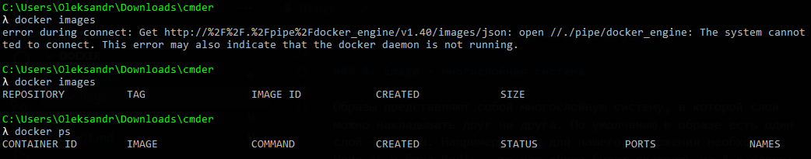

## 01. docker, image, container

### 1. Что такое Docker 

**Docker** - средство упаковки, доставки и запуска приложения.  

С его помощью можно:
- упаковать все необходимые для приложения зависимости в контейнер
- доставить этот контейнер на необходимый сервер 
- запустить этот контейнер (запустить приложение) на этом сервере

Запуск контейнеров (приложений) осуществляется всегда одинаково, будь это приложение на Python или Java, так как Docker имеет единый интерфейс (единые команды).

### 2. Основные сущности Docker

В Docker есть две основных сущности:
- **docker image (образ)** - это все то, что должно быть упаковано в контейнер - готовое к запуску приложение, но еще не запущенное
- **docker container** - запущенное приложение, созданное на базе image

То-есть, когда приложение упаковано, мы можем на основе этого упакованного образа создать много одинаковых контейнеров.

### 3. image - read-only система

Для контейнера образ является read-only системой - он не может его изменить.   
То-есть, когда на основе образа запускается контейнер и внутри контейнера мы выполним, например, команду удаления чего-либо, то данные будут удалены только в рамках данного контейнера, и на образ это никак не повлияет.  
Мы можем остановить контейнер, удалить его и на основе образа создать новый контейнер.

### 4. image - многослойная система

Образы представляют собой многослойную систему, в которой слои можно накладывать друг на друга. По умолчанию в образе есть один слой - Ubuntu. Например, если для нашего приложения необходим Node.js и база Redis - то наш образ будет состоять из 4-х слоев: Ubuntu, Node.js, Redis и непоследственно приложение. 

### 5. Откуда брать image?

Образы хранятся на **Dockerhub** [ https://hub.docker.com/ ] - это реестр, где хранятся образы которые создают непосредственно разработчики Docker, а также другие пользователи.

### 6. Проверить, что Docker запущен

Чтобы проверить, что Docker запущен корректно, можно выполнить одну из комманд:
- **docker images** - просмотреть локальные образы
- **docker ps** - просмотреть запущенные контейнеры

На фото ниже мы выдим, что должно быть отображено в консоли в случаи ошибки и в случаи удачного запуска:   

