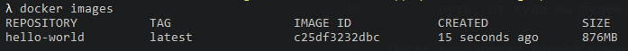
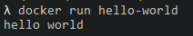
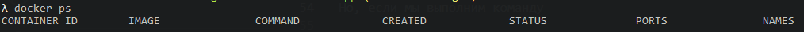
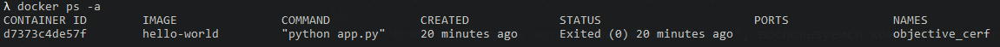
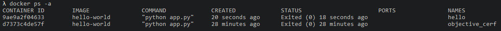

## 02. dockerfile, первое приложение

Создадим приложение на python, которое будет выводить 'hello world', и запакуем его в docker.   
См. директорию *hello-app*.   

### 1. Создаем python-приложение 

Создаем файл *app.py*:
```py
print ('hello world')
```

### 2. Создаем Dockerfile

**Dockerfile** - файл, в котором указываем Докеру как упаковывать приложение.   

Создаем файл *Dockerfile*:
```Dockerfile
FROM python:3.7
RUN mkdir -p /usr/src/app
WORKDIR /usr/src/app/
COPY . /usr/src/app/
CMD ["python", "app.py"]
```

Команды описанные в Dockerfile:
- `FROM` - базовый image (образ), с которого мы начинаем сборку. Мы говорим, что базовым образом мы хотим видеть python и через двоеточие указываем версию 3.7.
- `RUN` - определяет, что нужно выполнить какую-то команду. В даном случаи это команда *mkdir -p /usr/src/app*, которая говорит, что нужно создать вложенную структуру каталогов внутри контейнера (ключ -p позволяет создавать вложенную структуру каталогов, а не один, как просто mkdir)
- `WORKDIR` - определяет с какого каталога начинать работу внутри контейнера
- `COPY` - принимает 2 параметра "откуда - куда" - с нашей машину в контейнер. Точка говорит - с текущей директории нашей машины, путь */usr/src/app* - говорит в новосозданную папку внутри контейнера
- `CMD` - определяет, что нужно cделать когда мы запустим контейнер, в нашем случаи нужно выполнить команду *python app.py*

Вместо команды *CMD ["python", "app.py"]*, можно было написать *ENTRYPOINT ["python", "app.py"]*.    
Разница между CMD и ENTRYPOINT: https://habr.com/ru/company/southbridge/blog/329138/

### 3. Создаем image (образ)

С помощью команды **`docker build -t hello-world .`** создаем image, где:
- `-t` тег, которому передаем имя image - `hello-world` 
- `.` путь, от куда мы будем собирать приложение (точка - это текущая директория)

После выполнения данной команды начнется сборка image, которая займет длительное время.  
После завершения сбоки, выполнив команду **`docker images`**, чтобы просмотреть существующие образы, мы увидим, что запущен образ 'hello-world':   


### 4. Запуск контейнера 

Теперь можно **запустить контейнер** на базе образа 'hello-world' выполнив команду **`docker run hello-world`**:


В результате выполнения данной команды отработал код нашего python-приложения - в консоли мы видим 'hello world'.  
Но, если мы выполним команду **`docker ps`**, чтобы **просмотреть запущенные контейнеры**, мы ничего не увидим:


Так произошло потому, что контейнер работает до тех пор, пока работает приложение. Поскольку наше приложение вывело 'hello world' и завершило работу, то и контейнер остановился, но он никуда не исчез.  

**Чтобы просмотреть остановленные контейнеры**, воспользуемся командой **`docker ps -a`**:


Как мы видим, в поле NAMES нашего контейнера указано 'objective_cerf' - это имя, которое docker присвоил контейнеру. Чтобы **задать имя контейнеру**, при запуске нужно воспользоваться флагом '--name' передав ему имя, например 'hello' - **`docker run --name hello hello-world`**.   
Теперь, если просмотреть контейнеры (**`docker ps -a`**), мы увидим, что отработало 2 контейнера:


---

**Все остальные команды - см. файл *00. Команды.md***

https://tproger.ru/translations/top-10-docker-commands/
https://www.youtube.com/watch?v=QF4ZF857m44&t=724s
30:50