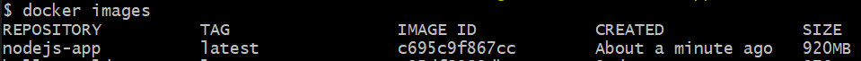
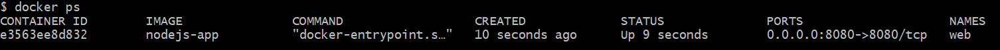
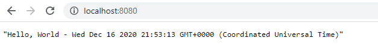

## 03. node приложение

Создадим nodejs-приложение и запакуем его в Docker.  
См. директорию *nodejs-app*.  

### 1. Создаем приложение 

Наше веб-приложение будет выполнять следующее - когда открываем страницу http://localhost:8080/, то открывается файл *nodejs-app\data.json*:

```json 
{ "payload": "Hello, World" } 
```

и оттуда достается содержимое поля 'payload' к которому добавляется текущая дата, и это все возвращается пользователю.

*nodejs-app\index.js*:
```js
const fs = require('fs')
const express = require('express')
const app = express()

let fileContent = fs.readFileSync("data.json", "utf8");
let data = JSON.parse(fileContent)
let result = data.payload + ' - ' + new Date()

app.get('/', (req, res) => {
	res.status(200).json(result)
})

const port = 8080

app.listen(port, () => console.log(`server work at http://localhost:${port}/`))
```

### 2. Создаем Dockerfile

```Dockerfile
FROM node:12
RUN mkdir -p /usr/src/app/
WORKDIR /usr/src/app/
COPY . /usr/src/app/
RUN npm install
EXPOSE 8080
CMD ["node", "index"]
```

Команды описанные в Dockerfile:
- `FROM` - базовый image (образ), с которого мы начинаем сборку. Мы говорим, что базовым образом мы хотим видеть node и через двоеточие указываем версию 12.
- `RUN` - определяет, что нужно выполнить какую-то команду. В даном случаи это команда *mkdir -p /usr/src/app*, которая говорит, что нужно создать вложенную структуру каталогов внутри контейнера (ключ -p позволяет создавать вложенную структуру каталогов, а не один, как просто mkdir)
- `WORKDIR` - определяет с какого каталога начинать работу внутри контейнера
- `COPY` - принимает 2 параметра "откуда - куда" - с нашей машину в контейнер. Точка говорит - с текущей директории нашей машины, путь */usr/src/app* - говорит в новосозданную папку внутри контейнера
- `RUN` - определяет, что нужно выполнить какую-то команду. В даном случаи это команда *npm install*
- `EXPOSE` - определяет, какие порты будет использовать приложение внутри контейнера
- `CMD` - определяет, что нужно cделать когда мы запустим контейнер, в нашем случаи нужно выполнить команду *node index*

### 3. Создаем image (образ)

С помощью команды **`docker build -t nodejs-app .`** создаем image, где:
- `-t` тег, которому передаем имя image - `nodejs-app` 
- `.` путь, от куда мы будем собирать приложение (точка - это текущая директория)

После выполнения данной команды начнется сборка image, которая займет длительное время.  
После завершения сбоки, выполнив команду **`docker images`**, чтобы просмотреть существующие образы, мы увидим, что запущен образ 'nodejs-app':   


### 4. Запуск контейнера 

Теперь можно **запустить контейнер** на базе образа 'nodejs-app' выполнив команду **`docker run --rm --name web -p 8080:8080 -d nodejs-app`**:

 
Данная команда говорит:
- `docker run` - запустить контейнер 
- `--rm` - после завершения работы контейнера или в случаи его остановки - контейнер самостоятельно удалится
- `--name web` - присвоить контейнеру имя 'web'
- `-p 8080:8080` - порт_хоста : порт_контейнера
- `-d` - запуск контейнера в фоновом режиме
- `nodejs-app` - контейнер запускается на базе 'nodejs-app' образа

Теперь, если открыть в браузере http://localhost:8080/, то мы увидим:   


### 5. Переменные окружения

Как мы видим на скриншоте выше, все работает корректно за исключением времени - оно не соответствует нашей временной зоне, так как внутри контейнера установленна другая timezone. Исправим это, используя переменную окружения.  
Переменные окружения используются, когда нужно указать путь к файлу, id каких-то клиентов, url каких-то микро-сервисов и т.д.

```Dockerfile
# FROM node:12
# RUN mkdir -p /usr/src/app/
# WORKDIR /usr/src/app/
# COPY . /usr/src/app/
# RUN npm install
# EXPOSE 8080
ENV TZ Europe/Kiev
# CMD ["node", "index"]
```
Теперь все работает корректно.

Но что, если наше приложение будет запущено в разных временных зонах, в таком случаи прийдется каждый раз изменять Dockerfile и заново создавать image, что займет много времени. Для таких случаев есть другой способ задания переменной окружения - в момент создания контейнера с помощью флага *-e TZ=Europe/Kiev:*  

**`docker run --rm --name web -p 8080:8080 -d -e TZ=Europe/Kiev nodejs-app`**