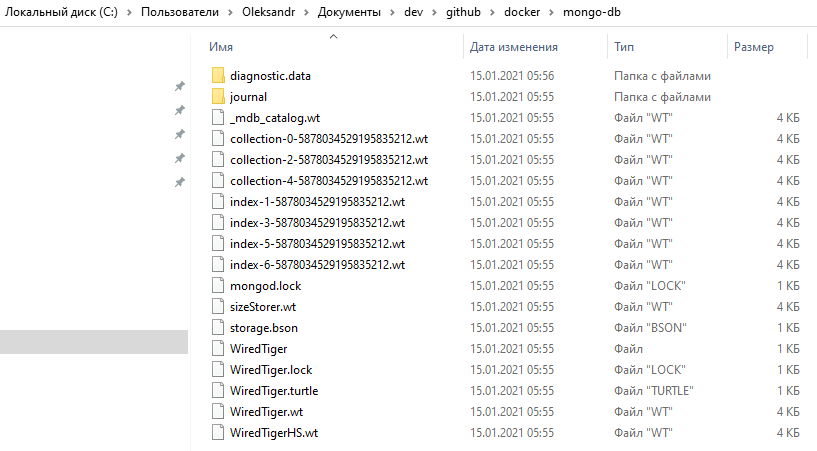

## 04. volume, mongo-db 

Когда работает контейнер - это значит работает приложение, внутри которого происходит работа с данными. Когда контейнер будет остановлен или удален - все данные будут утеряны.   

Но что если внутри контейнера работает база данных, цель которой как раз таки сохранить данные. Чтобы предотвратить потерю данных в случаи остановки или удаления контейнера, docker предоставляет механизм Volume, с помощью которого контейнер может работать с внешними источниками данных.   

Простыми словами, **Volume - это папка на хостовой машине прикрепленная к контейнеру**, и когда контейнер будет остановлен или удален - данные в этой папке не пострадают. 

### Рассмотрим как подключить volume к контейнеру на примере базы дынных MongoDB

**1. Скачиваем image базы дынных MongoDB**      
`docker pull mongo:latest`

**2. Создаем папку на хосте, которая будет выступать в роли volume для контейнера, и переходим в неё**   
`C:\Users\Oleksandr\Documents\dev\github\docker\mongo-db`

**3. Запускаем контейнер, прикрепляя к нему volume**   
`docker run --rm --name mymongo -p 2717:27017 -d -v //c/Users/Oleksandr/Documents/dev/github/docker/mongo-db:/data/db mongo`

Данная команда говорит:
- `docker run` - запустить контейнер 
- `--rm` - после завершения работы контейнера или в случаи его остановки - контейнер самостоятельно удалится
- `--name mymongo` - присвоить контейнеру имя 'mymongo'
- `-p 2717:27017` - [порт хоста] : [на каком порту работает MongoDB внутри контейнера (27017 - дефолтный порт MongoDB)]
- `-d` - запустить контейнер в фоновом режиме
- `-v //c/Users/Oleksandr/Documents/dev/github/docker/mongo-db:/data/db` - параметр `-v` говорит, что мы прикрепляем volume-папку к контейнеру. Параметры `1й_параметр:2й_параметр` говорят:  
  - 1й параметр - абсолютный путь к папке на хосте, которую нужно прикрепить к контейнеру
  - 2й параметр - абсолютный путь к папке внутри контейнера (`/data/db` - дефолтный путь к каталогу, где mongo хранит данные)
- `mongo` - контейнер запускается на базе 'mongo' образа

В результате выполнения данной комманды мы получим запущенный контейнер с прикрепленной папкой, которая хранится на хостовой машине и которая в результате выполнения комманды выше будет заполнена базой данных MongoDB:    

Теперь если контейнер будет остановлен или удален - база данных по прежнему будет существовать на хосте. 
