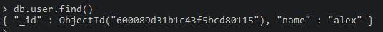

## 05. Внутри mongo-db контейнера 

Задача данного урока - научиться входить внутрь запущенного контейнера. Рассмотрим как это делать на примере контейнера, созданного нами на базе MongoDB image в предыдущем уроке.    

Входим внутрь запущенного 'mymongo' контейнера:         
`docker exec -it mymongo bash`    

Запускаем базу данных MongoDB внутри контейнера:    
`mongo`   

Просмотр списка баз данных:   
`show dbs`    
В результате видим 3 дефолтные базы данных:    
     

Создаем собственную базу данных:     
`use test`   

Добавляем запись в базу данных:     
`db.user.insert({"name":"alex"})`       

Получаем все данные:     
`db.user.find()`    

Выходим из MongoDB:    
`exit`    

Выходим из контейнера и возвращаемся на хост:     
`exit`     

**Также вход в MongoDB можно выполнить без входа в контейнер**. Для этого на машине должна быть установленна MongoDB, и соответственно контейнер должен быть запущен (см. пред. урок `docker run --rm --name mymongo -p 2717:27017 -d -v //c/Users/Oleksandr/Documents/dev/github/docker/mongo-db:/data/db mongo`):   
    
`mongo localhost:2717`

